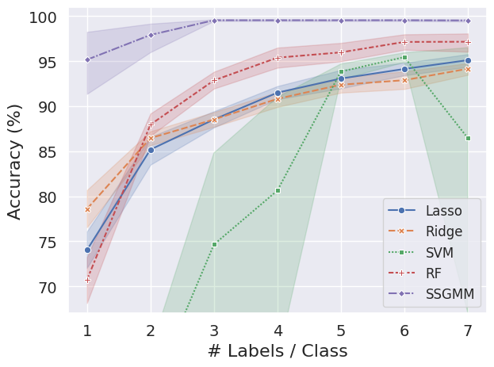
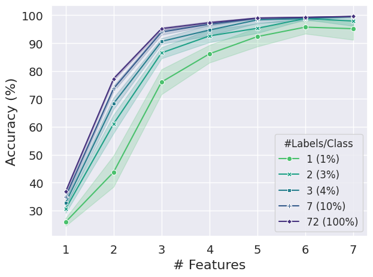

# Semi-supervised Gaussian Mixture Model (SSGMM)
with an example of crop recommendation

Various Models by #Labels | SSGMM by #Features 
:------------------------:|:----------------------:
    | 

## Main Implementation
Refer to `SemiSupervisedGMM` class in `ssgmm.py` for the SSGMM implementation details.

It supports `full` and `diagonal` covariance matrices.

## Crop Recommendation Experiments

### Environment
This project was implemented and tested with Python 3.10.
One may create a conda environment using the provided `environment.yml` files:

```
conda env create -f environment.yml
```

```
conda activate ssgmm
```

### Data
Download `Crop_recommendation.csv` from the following Kaggle dataset

https://www.kaggle.com/datasets/atharvaingle/crop-recommendation-dataset

and save it to `./data/crop_recommendation.csv`

### Basic Data Exploration
See `0_data_exploration.ipynb`

### Data Pre-processing
Run

```
python 1_data_preprocessing.py
```

It will generate multiple pre-processed dataset at `./data/` directory: `seed_<SEED>_full.npz` and `seed_<SEED>_labeled_<NUM_LABELS_PER_CLASS>.npz` where `<SEED>` = 0, 1, ..., 9.

`seed_<SEED>_full.npz` contains Numpy arrays - `X_train`, `y_train`, `X_val`, `y_val`, `X_test`, `y_test` - 72% train, 8% validation, and 20% test splits and each `X` array was column-wise scaled by the Min/Max values of `X_train`.

`seed_<SEED>_labeled_<NUM_LABELS_PER_CLASS>.npz` contains Numpy arrays - `X_train_l`, `y_train_l`, `X_train_u`, `y_train_u`, `X_val`, `y_val`, `X_test`, `y_test` - where `X_train` and `y_train` of `seed_<SEED>_full.npz` were split into `<NUM_LABELS_PER_CLASS>` labeled and unlabeled samples

There will be also `label_to_crop_map.pkl`, which contains a dictionary of `LABEL: CROP_NAME` pairs, and it can be used in future analyses.

### Model Training and Evaluation
Run

```
python 2_fit_models.py
```

It will train and evaluate 10 sets of Lasso/Ridge Logistic Regression, Support Vector Machine, Random Forest, (all from Scikit-learn), and the implemented SSGMM using the pre-generated fully/partially labeled datasets.
The trained models and their test set evaluation results will be stored at `./models/models_<DATASET_NAME>.pkl` and `./results/test_<DATASET_NAME>.csv`, respectively.

### Result Analysis
See `3_result_analysis.ipynb` for the evaluation results for all models and the feature importance extracted.

### SSGMM with different numbers of features
Run
```
python 4_fit_models_by_features.py
```
and then run `5_result_by_features_analysis.ipynb` to see the behavior of SSGMM trained with different numbers of features, in the order of feature importance.
